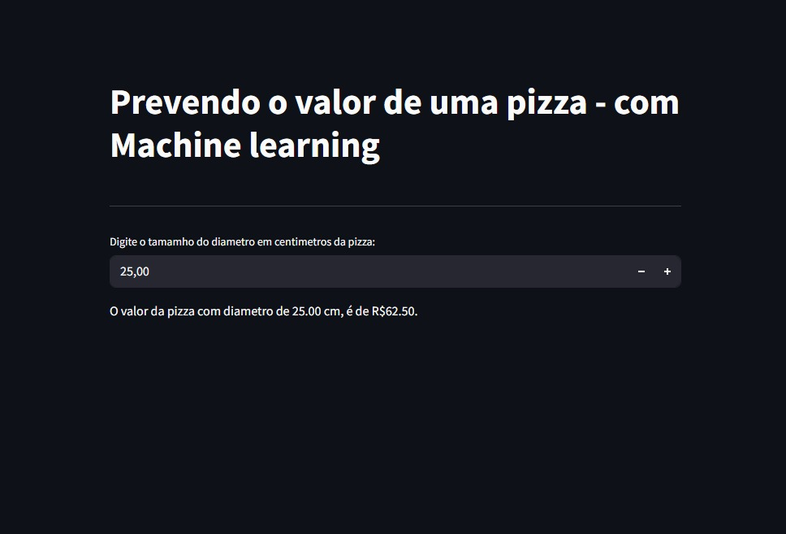
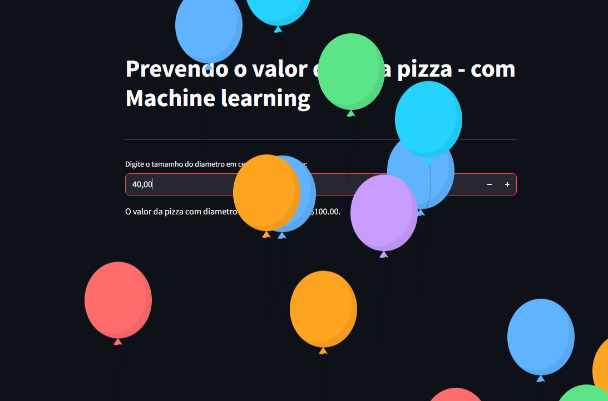

# 🍕 Previsão de Preço de Pizza com Machine Learning

Fala galera, tudo bem? Aqui é o Thiago!  
Esse é um projeto simples, mas muito bacana, usando **Machine Learning** com **Streamlit** para prever o preço de uma pizza com base no seu diâmetro. Tudo isso com uma interface web interativa e fácil de usar!

---

## 🚀 Tecnologias utilizadas

- **Python 3**
- **Jupyter Notebook (.ipynb)** – para testes e exploração inicial dos dados
- **Pandas** – para manipulação de dados
- **Scikit-learn (sklearn)** – para construir o modelo de regressão linear
- **Streamlit** – para criar uma interface web simples e intuitiva
- **Poetry** – para gerenciamento de dependências e ambiente virtual
- **Scoop** – usado para instalar o Poetry via terminal no Windows

---

## 💻 Como rodar o projeto localmente

### 1. Clone o repositório
```bash
git clone https://github.com/jhonatanthiago/projeto1_marchening_learning.git
cd projeto1_marchening_learning
```

### 2. Instale o Poetry (caso não tenha)
```bash
scoop install poetry
```

### 3. Instale as dependências do projeto
```bash
poetry install
```

### 4. Rode o app com o Streamlit
```bash
poetry run streamlit run app.py
```

---

## 🧠 Sobre o modelo

O modelo foi treinado usando **regressão linear** com base em um arquivo CSV (`pizzas.csv`) que contém os dados de diâmetro e preço das pizzas. A ideia é mostrar de forma didática como o **Machine Learning** pode ser aplicado em problemas simples do dia a dia.

---

## 📷 Imagens do projeto

### Interface do app - Parte 1


### Previsão gerada - Parte 2


---

## 🎥 Demonstração em vídeo

Veja o funcionamento do projeto no vídeo abaixo: 👇

[](https://youtu.be/KGa2JqqUXEs)

---

## 📁 Estrutura do projeto

```
projeto1_marchening_learning/
│
├── app.py                        # Código principal com Streamlit
├── pizzas.csv                    # Base de dados com preços e diâmetros
├── README.md                     # Este arquivo
├── pyproject.toml                # Configuração do Poetry
├── notebook.ipynb                # Análises e testes exploratórios
└── imagens_e_videos/             # Imagens e vídeo de demonstração
    ├── imagem1.png
    ├── imagem2.png
```

---

## 🤓 Autor

Desenvolvido por **Jhonatan Thiago** 

---

## ⭐ Deixe uma estrela!

Se esse projeto te ajudou, deixe uma ⭐ no repositório!
```
